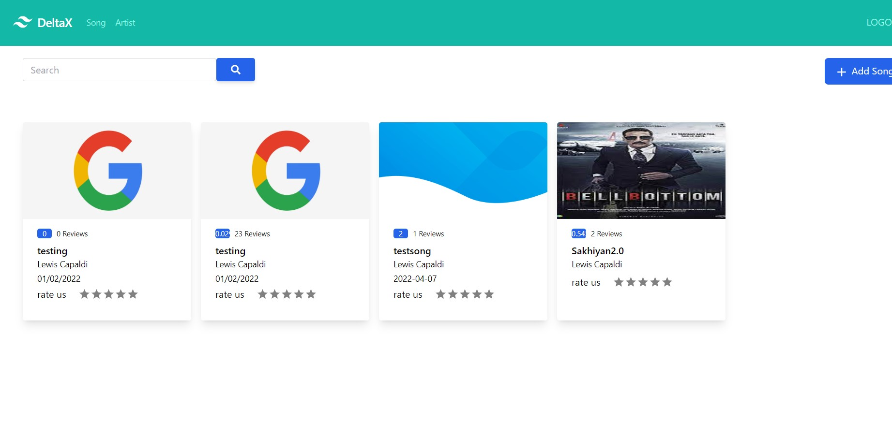
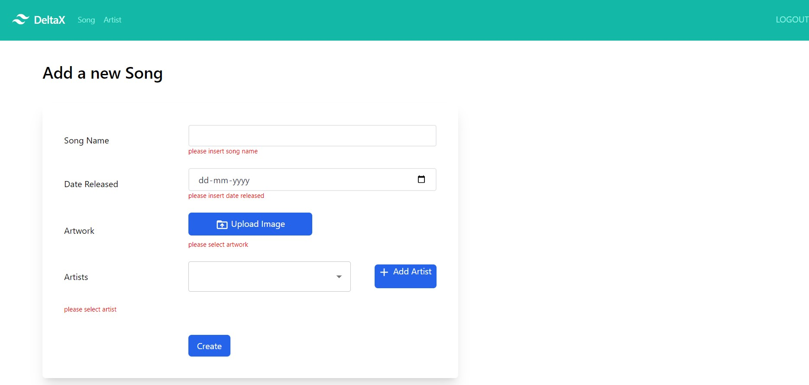
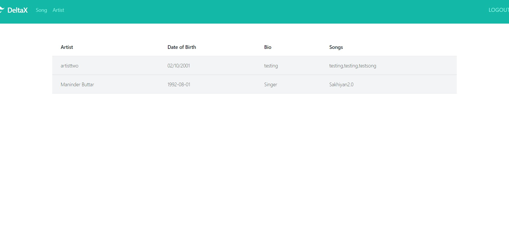
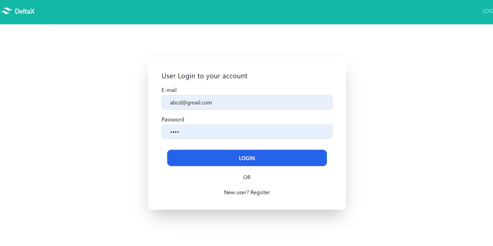

# DeltaX Assignment

It is an simple react based application in which we can register user, then user can create artist and assign them a song, user will rate according to there choice

### Live URL

https://stellar-longma-b8e6f6.netlify.app/

### Backend DataBase structure

### Artist

- Name
- DOB
- BIO
- id: Primary

### Song

- Name
- ReleaseDate
- CoverUrl
- id
- addedBy ( User id Foreign Key)

### ArtistSong

- artistId ( Foreign Key Table: Artist.id) Not unique Not Null
- songId ( Foreign Key Table: Song.id) Not unique Not Null
- id ( Mapping Id) Unique and Primary

### User

- id (primary)
- Name
- Email ( Unique )

### Rating

- id
- rating (1-5)
- userId ( Foreign Key Table: user.id) Not unique Not Null
- songId ( Foreign Key Table: Song.id) Not unique Not Null

### Built With

Major frameworks/libraries used in the project.

- [React.js](https://reactjs.org/)
- [Tailwind CSS](https://svelte.dev/)
- [NodeJS](https://laravel.com)
- [MySQL](https://getbootstrap.com)
- [Cloudinary](https://getbootstrap.com)

### ScreenShot

### Home screen

### Create Song

### User Login nd Register

### All Artist List

